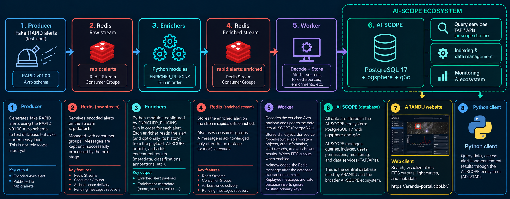

# Pipeline

## Current input

For now, the producer creates fake alerts using the [RAPID v01.00 Avro schema](https://github.com/Schwarzam/arandu/blob/main/arandu/producer.py#L121-L329). This is used to test ingestion and database behavior under load. It is not telescope input.

## Flow

`producer → Redis → enricher → Redis → worker → AI-SCOPE`

1. The producer encodes a fake RAPID alert and adds it to `rapid:alerts`.
2. The enricher reads the raw stream, runs the modules configured in `ENRICHER_PLUGINS`, and adds the alert and enrichment metadata to `rapid:alerts:enriched`.
3. The worker reads the enriched stream, decodes the Avro payload, and writes the records to the AI-SCOPE database.
4. AI-SCOPE stores and manages the data, including database indexes and query services.
5. The data can be accessed through the Arandu website or the Python client.

## Redis

Redis provides two work queues:

- `rapid:alerts`
- `rapid:alerts:enriched`

The enricher and worker use Redis consumer groups.

A message is acknowledged only after the next stage completes successfully. If a consumer stops before acknowledging a message, the pending message can be reclaimed by another consumer.

Redis is not used as the data archive. Processed stream entries are deleted after processing. The resulting records are stored in AI-SCOPE.

## Enrichers

Enrichers are Python modules configured through `ENRICHER_PLUGINS`.

They run in order for each alert. An enricher receives the alert and can read information from:

- the alert payload;
- the alert history stored in AI-SCOPE;
- or both.

Each enricher returns the alert and an enrichment result. A result can contain:

- name;
- version;
- value;
- additional fields.

The worker stores these results in the `arandu.enrichment` table in AI-SCOPE.

A detection can have results from multiple enrichers and multiple versions of the same enricher.

## Worker

The worker reads messages from `rapid:alerts:enriched` and decodes the enriched Avro payload.

It writes or updates the corresponding records in AI-SCOPE, including:

- `dia_object`;
- `dia_source`;
- `dia_forced_source`;
- solar-system records;
- orbit records;
- alert records;
- enrichment records.

When FITS cutout storage is enabled, the worker also writes the corresponding cutout files.

The Redis message is acknowledged only after the database transaction commits.

Replayed messages do not create duplicate records because inserts ignore existing primary keys.

## AI-SCOPE

AI-SCOPE provides the database and data-access layer used by Arandu.

The Arandu tables are stored in PostgreSQL within the AI-SCOPE infrastructure. AI-SCOPE is responsible for database operations such as:

- storage;
- indexes;
- query execution;
- database access;
- user permissions;
- TAP and API access;
- database monitoring.

The database uses PostgreSQL 17 with `pgsphere` and `q3c` for astronomical coordinate operations and spatial queries.

Arandu writes alert and enrichment records to this database through the worker. Other Arandu components query the same data through the AI-SCOPE services.

This separates alert processing from database and query management:

`Arandu → ingestion and enrichment`

`AI-SCOPE → storage, indexing, queries, and data access`

## Data access

Data stored by Arandu in AI-SCOPE can be accessed through two interfaces.

### Arandu website

The web interface provides access to alerts and associated data:

https://arandu-portal.cbpf.br/

It can be used to inspect alert records, source information, enrichment results, light curves, and FITS cutouts.

The website obtains its data from the AI-SCOPE ecosystem rather than maintaining a separate alert database.

### Python client

The Python client provides programmatic access to Arandu data.

Documentation:

https://arandu-portal.cbpf.br/docs/python-arandu/main

The client can be used to query alerts, sources, histories, and enrichment results through the data services provided by AI-SCOPE.

This allows the same stored data to be accessed through either the web interface or Python without creating separate data stores.

## Data path

The complete data path is:

`RAPID alert`
→ `producer`
→ `rapid:alerts`
→ `enrichers`
→ `rapid:alerts:enriched`
→ `worker`
→ `AI-SCOPE`
→ `Arandu website / Python client`

Redis handles communication between processing stages.

AI-SCOPE stores and serves the resulting data.

The Arandu website and Python client provide user access to the data.