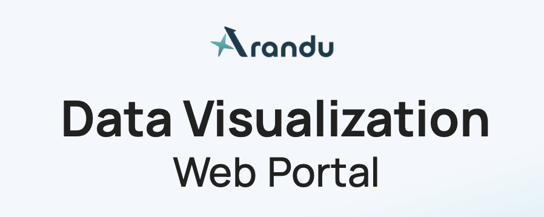

# Welcome to the Arandu portalasdijuasgh8udysago

Arandu is a workspace for exploring transient alerts, their photometry, and associated image cutouts.
asdasda

## What you can do

- Sign in with your ADSS account.
- Find DIA objects with a cone search.
- Review multi-band DIA PSF light curves and FITS cutouts.
- Open the calendar page to inspect daily observing activity.

## Adding documentation

Every Markdown file under `docs/` appears here. Nested folders become documentation sections. Keep images next to their document and reference them with normal relative Markdown links, such as ``.
